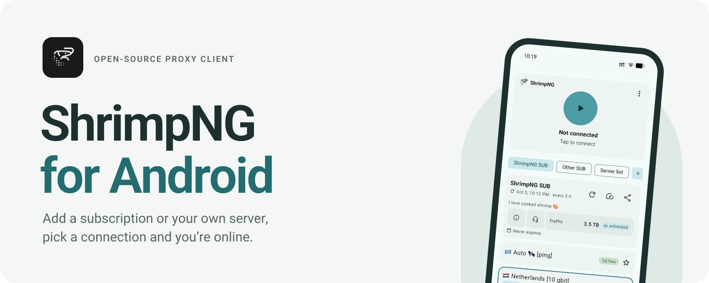
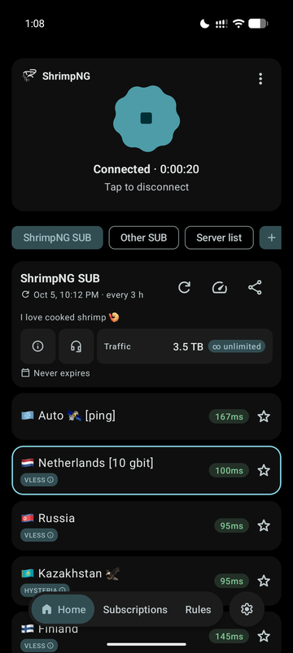
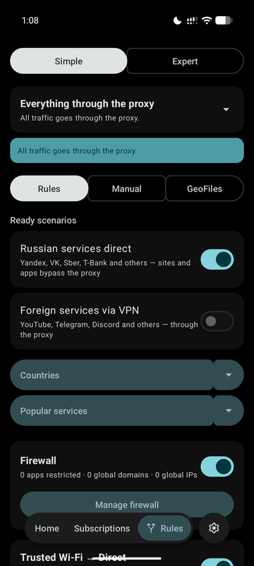
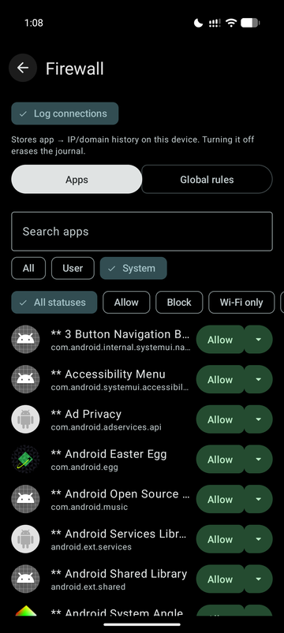
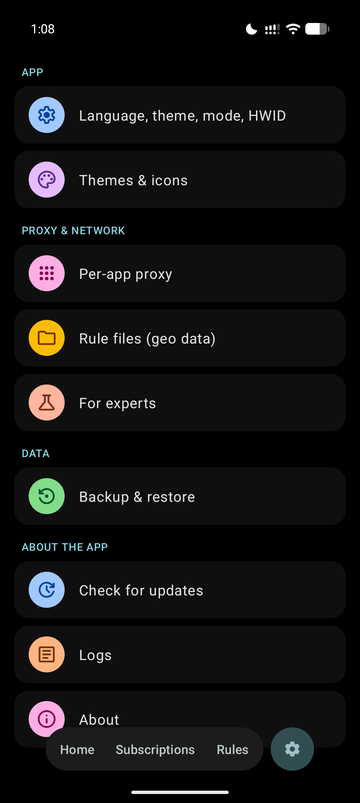
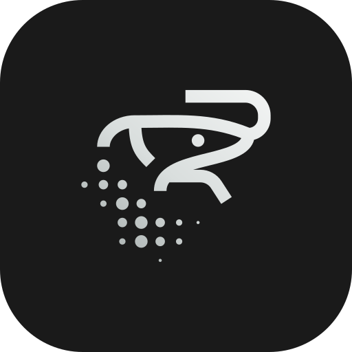

<picture>
  <source media="(prefers-color-scheme: dark)" srcset=".github/readme/banner-en-dark.svg">
  
</picture>

<br>

<p align="center">
  <a href="README.md"></a>
  <a href="README.ru.md"></a>
</p>

<p align="center">
  <a href="https://ng.shrimp.fish/download/"><b>Download</b></a>
  &nbsp;·&nbsp;
  <a href="https://ng.shrimp.fish/help/">Getting started</a>
  &nbsp;·&nbsp;
  <a href="https://github.com/ShrimpNG/ShrimpNG-Android/releases">Releases</a>
  &nbsp;·&nbsp;
  <a href="https://t.me/ShrimpNG">Telegram channel</a>
  &nbsp;·&nbsp;
  <a href="https://t.me/+8j05BK1_GKk5YjYy">Chat</a>
</p>

<p align="center">
  
  
  <a href="LICENSE"></a>
  
</p>

<br>

**ShrimpNG** is a free, open-source proxy client for Android. Paste a subscription link from any provider or set up your own server, pick a connection and tap connect. You decide which apps go through the proxy and which go direct.

It runs on [Xray-core](https://github.com/XTLS/Xray-core) and grew out of [v2rayNG](https://github.com/2dust/v2rayNG), redesigned from the ground up in Material 3 Expressive.

## Download

Every APK works on both 64-bit and 32-bit phones, so there is only one file to choose:

| Build | Android | Who it's for |
| :-- | :-- | :-- |
| **[ShrimpNG](https://ng.shrimp.fish/releases/shrimpng-latest.apk)** | 12 and newer | Most phones. Picks up Material You colours from your wallpaper. |
| **[FOSS Calculator](https://ng.shrimp.fish/releases/foss-calculator-latest.apk)** | 12 and newer | The same app dressed as a calculator: its icon and name are a calculator's in the launcher, in Settings and in Android's VPN prompt. |
| **[ShrimpNG Legacy](https://ng.shrimp.fish/releases/shrimpng-legacy-latest.apk)** | 8 and newer | Android 8–11, and Huawei or Honor phones on EMUI or HarmonyOS 2–4. |

> [!TIP]
> All three are the same app and install over one another without losing your settings. If Android says *"There was a problem parsing the package"*, your phone needs **Legacy**.

Older versions and release notes are on [GitHub Releases](https://github.com/ShrimpNG/ShrimpNG-Android/releases).

## Getting started

1. **Install.** Download the APK for your Android version and open it on the phone. If Android asks, allow installing apps from this source.
2. **Add a connection.** On the Home screen, tap **+ Add**. You can paste a link from the clipboard, scan a QR code or enter a server by hand.
3. **Connect.** Pick a server, tap the big button and confirm Android's VPN request.

The [step-by-step guide](https://ng.shrimp.fish/help/) covers per-app rules and common questions.

## What's inside

<table>
<tr>
<td width="50%" valign="top">

### Subscriptions and servers
- Add by link, from the clipboard or by QR code, WireGuard configs included
- Automatic updates, ping over HTTP, TCP or TLS, and favourites
- Traffic used, expiry date and your provider's support in one card
- A reminder before a subscription runs out, with a button to renew
- Hold **Home** in the dock to switch subscriptions in one gesture

</td>
<td width="50%" valign="top">

### Routing
- Choose which apps use the proxy and which bypass it
- Ready-made scenarios, such as local services direct and the rest through the proxy
- Rules by country, by popular service, or your own domains and IPs
- A per-app firewall
- Trusted Wi-Fi networks that always connect directly

</td>
</tr>
<tr>
<td width="50%" valign="top">

### Looks
- Material 3 Expressive throughout, with a floating dock
- Light, dark and AMOLED black
- Material You colours, or one of 16 built-in palettes
- Apple or system emoji, so flags in server names look right
- Adapts to large fonts and display sizes

</td>
<td width="50%" valign="top">

### Privacy
- No ads and no analytics
- The calculator disguise, as its own build or switched on in the app
- Logs can be turned off entirely
- Expert settings (DNS, local proxy, MTU, Mux, fragmentation) are kept out of the way

</td>
</tr>
</table>

**Protocols:** VLESS · VMess · Trojan · Shadowsocks · Hysteria2 · WireGuard · SOCKS · HTTP

## Screenshots

<p align="center">
  
  
  
  
</p>

## For providers

ShrimpNG reads the usual subscription response headers and shows them on the subscription card:

| Header | Shown as |
| :-- | :-- |
| `profile-title` | The subscription's name |
| `subscription-userinfo` | Traffic used and limit, and the expiry date |
| `announce` | A short text under the name |
| `support-url` | The support button (a Telegram icon for `t.me` links) |
| `profile-web-page-url` | The ⓘ button |
| `profile-update-interval` | How often the subscription updates |

When it updates a subscription, the app sends `User-Agent: ShrimpNG/<version>` and the device headers `X-HWID`, `X-Device-OS`, `X-Ver-OS` and `X-Device-Model`. Users can turn the device headers off in Settings.

## Questions

<details>
<summary><b>The APK won't install: "There was a problem parsing the package"</b></summary>
<br>

Your Android is older than the build needs. Use **[ShrimpNG Legacy](https://ng.shrimp.fish/releases/shrimpng-legacy-latest.apk)**, which runs on Android 8 and newer.
</details>

<details>
<summary><b>Will it work with my provider?</b></summary>
<br>

Yes, if your provider gives you a subscription link, a key or a QR code for any of the protocols above. ShrimpNG isn't tied to any provider.
</details>

<details>
<summary><b>What is FOSS Calculator?</b></summary>
<br>

The same ShrimpNG, wearing a calculator's icon and name from the first launch, so a VPN client doesn't stand out on the phone. The disguise can also be switched on in the regular build under Themes & icons.
</details>

<details>
<summary><b>Does it work on Huawei?</b></summary>
<br>

Yes, with the **Legacy** build, on EMUI and on HarmonyOS 2–4. HarmonyOS NEXT (5.0 and newer) doesn't run Android apps at all.
</details>

<details>
<summary><b>Building from source</b></summary>
<br>

You need JDK 17 and the Android SDK. The Android project lives in `V2rayNG/`.

```bash
./build-release.sh               # all three universal APKs, into releases/
./build-release.sh arm64-v8a     # ShrimpNG and FOSS Calculator for one ABI only
```

To build one variant by hand:

```bash
cd V2rayNG
./gradlew assemblePlaystoreRelease -PUNIVERSAL=true                    # ShrimpNG
./gradlew assemblePlaystoreRelease -PUNIVERSAL=true -PDISGUISED=true    # FOSS Calculator
./gradlew assemblePlaystoreRelease -PLEGACY=true                       # ShrimpNG Legacy
```

Release signing reads `SHRIMPNG_STORE_PASSWORD`, `SHRIMPNG_KEY_ALIAS` and `SHRIMPNG_KEY_PASSWORD` from your own `gradle.properties`. The prebuilt Xray core (`V2rayNG/app/libs/libv2ray.aar`) is committed; its Go sources are in `AndroidLibXrayLite/` and `third_party/xray-core/`, built with gomobile.
</details>

## Credits

ShrimpNG is based on [v2rayNG](https://github.com/2dust/v2rayNG) by 2dust and runs on [Xray-core](https://github.com/XTLS/Xray-core). The calculator icon comes from [Fossify Calculator](https://github.com/FossifyOrg/Calculator) (GPL-3.0), and the interface icons are [Material Symbols](https://fonts.google.com/icons) (Apache 2.0).

Licensed under [GPL-3.0](LICENSE).

<p align="center">
  
</p>
