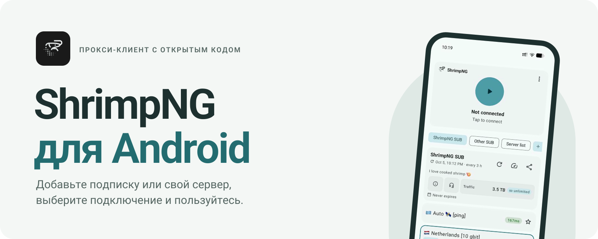

<picture>
  <source media="(prefers-color-scheme: dark)" srcset=".github/readme/banner-ru-dark.svg">
  
</picture>

<br>

<p align="center">
  <a href="README.md"></a>
  <a href="README.ru.md"></a>
</p>

<p align="center">
  <a href="https://ng.shrimp.fish/download/"><b>Скачать</b></a>
  &nbsp;·&nbsp;
  <a href="https://ng.shrimp.fish/help/">Как начать</a>
  &nbsp;·&nbsp;
  <a href="https://github.com/ShrimpNG/ShrimpNG-Android/releases">Релизы</a>
  &nbsp;·&nbsp;
  <a href="https://t.me/ShrimpNG">Канал в Telegram</a>
  &nbsp;·&nbsp;
  <a href="https://t.me/+8j05BK1_GKk5YjYy">Чат</a>
</p>

<p align="center">
  
  
  <a href="LICENSE"></a>
  
</p>

<br>

**ShrimpNG** — бесплатный прокси-клиент для Android с открытым кодом. Добавьте ссылку на подписку от любого провайдера или свой сервер, выберите подключение и пользуйтесь. Какие приложения пойдут через прокси, а какие напрямую, решаете вы.

Работает на [Xray-core](https://github.com/XTLS/Xray-core). Вырос из [v2rayNG](https://github.com/2dust/v2rayNG) и полностью переделан в Material 3 Expressive.

## Скачать

Каждый APK подходит и для 64-битных, и для 32-битных телефонов, так что выбирать нужно только одно — сборку:

| Сборка | Android | Для кого |
| :-- | :-- | :-- |
| **[ShrimpNG](https://ng.shrimp.fish/releases/shrimpng-latest.apk)** | 12 и новее | Для большинства телефонов. Цвета Material You из ваших обоев. |
| **[FOSS Calculator](https://ng.shrimp.fish/releases/foss-calculator-latest.apk)** | 12 и новее | То же приложение под видом калькулятора: иконка и название калькулятора в лаунчере, в настройках и в системном окне VPN. |
| **[ShrimpNG Legacy](https://ng.shrimp.fish/releases/shrimpng-legacy-latest.apk)** | 8 и новее | Android 8–11, а также Huawei и Honor на EMUI или HarmonyOS 2–4. |

> [!TIP]
> Все три сборки — одно и то же приложение, они ставятся друг поверх друга без потери настроек. Если Android пишет *«При анализе пакета произошла ошибка»*, вашему телефону нужна **Legacy**.

Старые версии и описания выпусков — на [GitHub Releases](https://github.com/ShrimpNG/ShrimpNG-Android/releases).

## Как начать

1. **Установите.** Скачайте APK для своей версии Android и откройте его на телефоне. Если Android спросит, разрешите установку приложений из этого источника.
2. **Добавьте подключение.** На главном экране нажмите **+ Добавить**: вставьте ссылку из буфера обмена, отсканируйте QR-код или введите сервер вручную.
3. **Подключитесь.** Выберите сервер, нажмите большую кнопку и подтвердите запрос Android на VPN.

В [подробной инструкции](https://ng.shrimp.fish/help/) — правила для приложений и ответы на частые вопросы.

## Что внутри

<table>
<tr>
<td width="50%" valign="top">

### Подписки и серверы
- Добавление по ссылке, из буфера и по QR-коду, в том числе конфиги WireGuard
- Автообновление, проверка пинга по HTTP, TCP или TLS, избранные серверы
- Трафик, срок действия и поддержка провайдера — в одной карточке
- Напоминание перед окончанием подписки, с кнопкой продления
- Удержание **«Главного»** в доке — быстрое переключение подписок одним жестом

</td>
<td width="50%" valign="top">

### Маршрутизация
- Выбор приложений, которые идут через прокси или мимо него
- Готовые сценарии: например, российские сервисы напрямую, остальное через прокси
- Правила по странам, популярным сервисам или своим доменам и IP
- Файрвол для отдельных приложений
- Доверенные сети Wi-Fi, где всё идёт напрямую

</td>
</tr>
<tr>
<td width="50%" valign="top">

### Оформление
- Material 3 Expressive везде, плавающий док
- Светлая, тёмная и чёрная AMOLED-тема
- Цвета Material You или одна из 16 встроенных палитр
- Эмодзи Apple или системные — флаги в названиях серверов выглядят как надо
- Подстраивается под крупный шрифт и увеличенный масштаб экрана

</td>
<td width="50%" valign="top">

### Приватность
- Без рекламы и аналитики
- Маскировка под калькулятор — отдельной сборкой или включается в приложении
- Логи можно выключить полностью
- Настройки для экспертов (DNS, локальный прокси, MTU, Mux, фрагментация) убраны в отдельный раздел

</td>
</tr>
</table>

**Протоколы:** VLESS · VMess · Trojan · Shadowsocks · Hysteria2 · WireGuard · SOCKS · HTTP

## Скриншоты

<p align="center">
  
  
  
  
</p>

## Провайдерам

ShrimpNG читает стандартные заголовки ответа подписки и показывает их в карточке подписки:

| Заголовок | Что показывает |
| :-- | :-- |
| `profile-title` | Название подписки |
| `subscription-userinfo` | Израсходованный трафик, лимит и дату окончания |
| `announce` | Короткий текст под названием |
| `support-url` | Кнопку поддержки (для ссылок `t.me` — со значком Telegram) |
| `profile-web-page-url` | Кнопку ⓘ |
| `profile-update-interval` | Как часто обновлять подписку |

При обновлении подписки приложение отправляет `User-Agent: ShrimpNG/<версия>` и заголовки устройства `X-HWID`, `X-Device-OS`, `X-Ver-OS` и `X-Device-Model`. Заголовки устройства пользователь может отключить в настройках.

## Вопросы

<details>
<summary><b>APK не ставится: «При анализе пакета произошла ошибка»</b></summary>
<br>

Версия Android на телефоне ниже, чем нужно сборке. Возьмите **[ShrimpNG Legacy](https://ng.shrimp.fish/releases/shrimpng-legacy-latest.apk)** — она работает на Android 8 и новее.
</details>

<details>
<summary><b>Подойдёт ли мой провайдер?</b></summary>
<br>

Да, если провайдер выдаёт ссылку на подписку, ключ или QR-код для любого из протоколов выше. ShrimpNG не привязан ни к какому провайдеру.
</details>

<details>
<summary><b>Что такое FOSS Calculator?</b></summary>
<br>

Тот же ShrimpNG, но с первого запуска с иконкой и названием калькулятора, чтобы VPN-клиент не бросался в глаза на телефоне. В обычной сборке маскировку тоже можно включить — в «Темах и иконках».
</details>

<details>
<summary><b>Работает ли на Huawei?</b></summary>
<br>

Да, сборка **Legacy** — на EMUI и HarmonyOS 2–4. HarmonyOS NEXT (5.0 и новее) Android-приложения не запускает вообще.
</details>

<details>
<summary><b>Сборка из исходников</b></summary>
<br>

Нужны JDK 17 и Android SDK. Android-проект лежит в `V2rayNG/`.

```bash
./build-release.sh               # все три универсальных APK — в releases/
./build-release.sh arm64-v8a     # ShrimpNG и FOSS Calculator только под одну ABI
```

Собрать один вариант вручную:

```bash
cd V2rayNG
./gradlew assemblePlaystoreRelease -PUNIVERSAL=true                    # ShrimpNG
./gradlew assemblePlaystoreRelease -PUNIVERSAL=true -PDISGUISED=true    # FOSS Calculator
./gradlew assemblePlaystoreRelease -PLEGACY=true                       # ShrimpNG Legacy
```

Для подписи релиза нужны `SHRIMPNG_STORE_PASSWORD`, `SHRIMPNG_KEY_ALIAS` и `SHRIMPNG_KEY_PASSWORD` в вашем собственном `gradle.properties`. Готовое ядро Xray (`V2rayNG/app/libs/libv2ray.aar`) лежит в репозитории; его исходники на Go — в `AndroidLibXrayLite/` и `third_party/xray-core/`, собираются через gomobile.
</details>

## Благодарности

ShrimpNG основан на [v2rayNG](https://github.com/2dust/v2rayNG) от 2dust и работает на [Xray-core](https://github.com/XTLS/Xray-core). Иконка калькулятора взята из [Fossify Calculator](https://github.com/FossifyOrg/Calculator) (GPL-3.0), значки интерфейса — [Material Symbols](https://fonts.google.com/icons) (Apache 2.0).

Лицензия — [GPL-3.0](LICENSE).

<p align="center">
  
</p>
